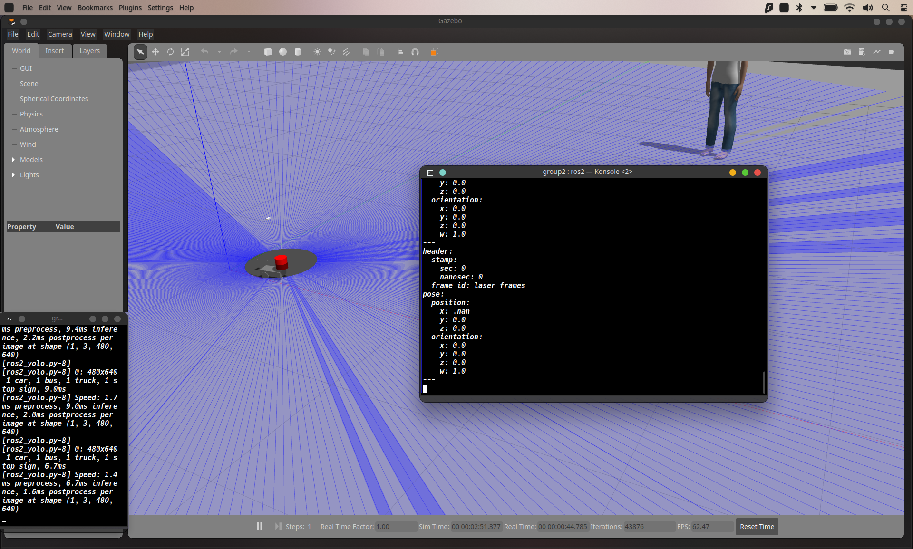
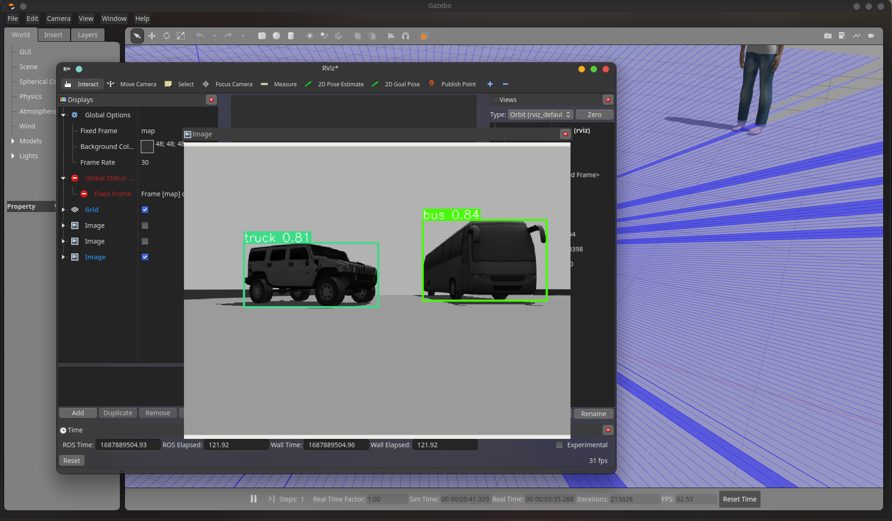

# DIfferential Drive Robot with Object Detection & Kalman Filtering

## Features
- Object Avoidance using LiDAR Sensor
- Object Detection using Yolo V8 
- Basic Kalman Filtering to estimate Pose

## Kalman Filtering

## Object Detection

## File Structure

## Pre-requisites
- Ubuntu 22.04
- ROS 2 Humble
- Gazebo 11
- Ultralytics (for Yolo)
- Model File

To get started clone this repository 

```sh
git clone https://github.com/ronith256/ROS2-Group2
```

## File Structure

    src
    ├── description
    │   ├── CMakeLists.txt
    │   ├── launch
    │   │   ├── spawn_bot.launch.py
    │   │   └── spawn_bot.py
    │   ├── package.xml
    │   └── urdf
    │       └── bot.urdf
    ├── robot
    │   ├── CMakeLists.txt
    │   ├── launch
    │   │   └── bot_control.launch.py
    │   ├── package.xml
    │   └── scripts
    │       ├── kalman_filter.py
    │       └── robot_control.py
    ├── world
    │   ├── CMakeLists.txt
    │   ├── launch
    │   │   ├── bot_launch.py
    │   │   └── world.launch.py
    │   ├── package.xml
    │   └── worlds
    │       ├── maze_world.world
    │       ├── prev_yolo_test.world
    │       └── yolo_test.world
    ├── yolo
    │   ├── CMakeLists.txt
    │   ├── launch
    │   │   └── launch_yolov8.launch.py
    │   ├── package.xml
    │   └── scripts
    │       ├── model.pt
    │       ├── ros2_yolo.py
    │       └── ros2_yolo_subscriber.py
    └── yolomsg
        ├── CMakeLists.txt
        ├── msg
        │   ├── InferenceResult.msg
        │   ├── SetPose.msg
        │   └── Yolov8Inference.msg
        └── package.xml

# Explanation

## description

- This package contains the robot description and it's urdf file.
- The launch directory contains 2 files. One which will launch the spawn.
- The CMakeLists is updated to include scripts.
#
## robot

- This package contains the launch file and scripts for robot control and kalman filter.

### kalman_filter.py
- This file contains the kalman filter Node for our project. 
- The filter is imported from filterpy.
- The output is the predicted position of the robot.

### robot_control.py
- This file controls the robot and implements basic object avoidance.
- The object avoidance is based on LiDAR sensor. 
- The LiDAR sensor data is published by the robot to 'scan' topic.

### bot_control.launch.py
- This launches 2 Nodes, the robot_control node and kalman_filter node.

## World
- This package contains the launch files for gazebo world and also the robot simulation. 
- The world is created using basic blocks from the Gazebo model library.

### world.launch.py
- This will simply launch the world in gazebo without robot in it.

### bot_launch.py
- This will launch the world with the robot in it. 
- It will also start the yolo image recognition node, robot control node.

### worlds
- This folder contains the world file to be launched in Gazebo.

## yolo
- This package contains the Node which does image recognition using Yolo 

### launch_yolov8.launch.py
- This is the launch file to start the yolo node.
- It will execute 'ros2_yolo.py' node

### ros2_yolo.py
- This Node does image recognition using Yolo V8.
- The camera data is got from 'rgb_cam/image_raw' from the robot. 
- The annoted frame is then published, it can be viewed using rviz2

## yolomsg
- This package contains the custom messages to be used with yolo node. 

### InferenceResult.msg
- It can be used to send class name and the bounding box details.

### Yolov8Inference.msg
- This is used to send custom array of 'yolov8_inference' object
#
# How to build
## Install the required libraries
- ROS2 Humble and Gazebo 11 should be installed.
- Python 3.10 was used.

```sh
pip install -r requirements.txt
```
## Build the project
- Clone this project to a directory and from the root directory run:

```sh
colcon build 
```
- This will build the whole project.
- Now source the built file.

```sh
. install/local_setup.bash
```
- Now we can launch the robot using:
```sh
ros2 launch world bot_launch.py
```
- We can see the Kalman Filter readings by subscribing to the topic
```sh
ros2 topic echo /filtered_pose
```
- We can see the Object Detection results using rviz2
```sh
rviz2
```
- Click on add -> By Topic -> Add Image

# Future Work
- [ ] Motion Planning Algorithm
- [ ] Path Planning Algorithm
- [ ] Dynamic Environment and use Kalman Filtering to find pose of objects.

## Troubleshooting
- If ros2 command does not work, source the ros opt folder.

## Contributors
- Nihil Dharsan -> Kalman Filtering
- Thanga Rohan -> Robot
- Ronith S -> Image Recognition Using yolov8

## Acknowledgements and Resources
- The Construct -> Tensorflow in ROS2 
- Articulated Robot -> Explanation on LiDAR

## License

This project is licensed under the MIT License - see the [LICENSE](LICENSE) file for details
